# DiaFoot.AI

**Production-grade Diabetic Foot Ulcer (DFU) detection, segmentation, and Wagner staging.**

DiaFoot.AI is a multi-task computer-vision pipeline for diabetic foot images. It does three
things in sequence: it **triages** a foot photo into `Healthy` / `Non-DFU` / `DFU`, it
**segments** the wound region when one is present, and it **measures** wound area in mm².
It is built to be honest about what it can and cannot do — the results below come from clean,
leakage-audited splits, not cherry-picked subgroups.

- **Package:** `diafootai` (v2.0.0), Python 3.12–3.13, PyTorch 2.10
- **Author:** Ruthvik Bandari
- **License:** MIT
- **Status:** Beta — research code, not a cleared medical device (see [Limitations](#limitations))

---

## Table of contents

- [What it does](#what-it-does)
- [Results (honest, clean splits)](#results-honest-clean-splits)
- [Architecture](#architecture)
- [Install](#install)
- [Quickstart](#quickstart)
- [Project structure](#project-structure)
- [Command reference](#command-reference)
- [REST API](#rest-api)
- [Limitations](#limitations)
- [Documentation](#documentation)
- [Citing / changelog](#citing--changelog)

---

## What it does

A single foot image goes through a **cascaded pipeline**:



```
image ──▶ [1] Triage classifier ──▶ Healthy / Non-DFU / DFU
                     │
                     ▼ (only if DFU or wound suspected)
             [2] Wound segmenter ──▶ binary wound mask
                     │
                     ▼
             [3] Area measurement ──▶ wound_area_mm²  +  quality/defer flags
```

The cascade is deliberate. v1 of this project segmented every image as if it contained an
ulcer — it had no concept of "not a wound." v2 puts a classifier in front so the system can
say "this is healthy skin" and abstain, and a **defer-to-clinician** gate that routes
low-confidence or low-quality images to human review instead of guessing. See
[docs/explanation-pipeline-design.md](docs/explanation-pipeline-design.md) for the why.

---

## Results (honest, clean splits)

All numbers below are on **leakage-audited train/val/test splits** (train 5,782 / val 1,162 /
test 1,161 images), re-verified after a data-leakage audit found and removed near-duplicate
train↔test pairs. Zero overlap remains across path, canonical-id, content-hash, and
perceptual-near-duplicate checks.

> **Note on older numbers.** `CHANGELOG.md` (v2.0.0, 2026-03-05) headlines a Dice of 85.89%.
> That figure is the **DFU-only, single-skin-tone subgroup** and predates the leakage fix. The
> honest, whole-test-set numbers are below. Where a metric is subgroup-specific, it says so.

### Triage classification — test set (n=1,161)

| Metric | Value |
|---|---|
| Accuracy | 98.4% |
| Macro F1 | 98.1% |
| Macro AUROC | 0.999 |
| DFU sensitivity (recall) | 96.6% |
| Healthy specificity | 99.5% |
| Calibration ECE (before → after temp. scaling) | 0.039 → 0.007 |
| Defer @ 0.95 confidence | 93.5% coverage, **99.7% accuracy on kept cases** |

### Wound segmentation — test set

| Slice | Dice | IoU | HD95 (px) | NSD@5mm |
|---|---|---|---|---|
| **DFU wounds only** (n=263) | 0.891 | 0.829 | 11.3 | 0.972 |
| **Full mixed test set** (n=1,161) | 0.65–0.72 mean / **0.93 median** | 0.67 | 66 | 0.71 |
| **5-fold CV** (DFU) | 0.853 ± 0.009 | 0.785 ± 0.009 | — | — |

The mixed-set **mean** Dice is much lower than the median because healthy/non-DFU images have
empty ground-truth masks: a single false-positive pixel scores Dice ≈ 0 on those, dragging the
mean down. On actual wounds the model is strong (median 0.93, DFU-only mean 0.89).

### Generalization, fairness, deployment

| Check | Result |
|---|---|
| External segmentation (unseen wounds, n=552) | Dice 0.893 — **no drop** vs internal DFU |
| External classification (unseen datasets) | Accuracy **0.21**, DFU sensitivity **0.0** — **does not generalize** |
| Skin-tone fairness (ITA), DFU-only | Gap **0.00** |
| Skin-tone fairness (ITA), full mixed set | Gap 0.114 — bias concern flagged |
| Test-Time Augmentation (16 augs, 200-img subset) | +3.9% Dice (0.574 → 0.613) |
| Wound-area agreement vs manual (n=3) | MAPE 3.3%, Pearson r 0.9997 — *tiny sample, indicative only* |
| ONNX vs PyTorch parity | 99.99% mask agreement, 4.5× faster (1056 ms → 235 ms) |

The **external classification collapse** is the single most important caveat: the segmenter
transfers to new wound datasets, but the triage classifier has learned dataset-specific
shortcuts and fails on out-of-distribution sources. Do not deploy the classifier on a new
image source without re-validating. See [Limitations](#limitations).

---

## Architecture



Two model families are implemented. The deployed API uses the **DINOv2 path**; the U-Net++ /
FUSegNet paths exist for research and ablation comparison.

| Stage | Deployed model | Alternatives (research) |
|---|---|---|
| Triage classifier | DINOv2 ViT + 3-class head, LoRA fine-tuned | EfficientNet-V2-M |
| Wound segmenter | DINOv2 + UPerNet decoder | U-Net++ (EfficientNet-B4, scSE), FUSegNet (EfficientNet-B7, P-scSE), nnU-Net v2 |
| Post-processing | Boundary refinement (morphological + connected-component filter) | — |

Training uses DiceCE / Dice-boundary compound losses, cosine annealing with linear warmup,
EMA weight tracking, early stopping, and BFloat16 mixed precision. Full module map:
[docs/reference-architecture.md](docs/reference-architecture.md).

---

## Install

Requires Python 3.12+ and (for training/GPU inference) a CUDA-capable GPU.

```bash
git clone https://github.com/Ruthvik-Bandari/DiaFoot.AI.git
cd DiaFoot.AI

python -m venv .venv && source .venv/bin/activate
pip install -e .            # runtime
pip install -e ".[dev]"     # + linters, mypy, pytest
```

Verify:

```bash
pytest -q                   # run the test suite
python -c "import src; print('ok')"
```

---

## Quickstart

**Predict on one image (CPU):**

```bash
python scripts/predict.py --image path/to/foot.jpg \
  --classifier-checkpoint checkpoints/classifier.pt \
  --segmenter-checkpoint checkpoints/segmenter.pt \
  --save-mask out_mask.png --device cpu
```

**Serve the REST API:**

```bash
uvicorn src.deploy.app:app --host 0.0.0.0 --port 8000
curl -F "file=@path/to/foot.jpg" http://localhost:8000/predict
```

Full walk-through from zero: [docs/tutorial-getting-started.md](docs/tutorial-getting-started.md).

---

## Project structure

```
DiaFoot.AI/
├── src/
│   ├── data/          Cleaning, preprocessing, augmentation, ITA, Wagner labeling,
│   │                  leakage audit, stratified splits, PyTorch Dataset
│   ├── models/        DINOv2 classifier/segmenter, U-Net++, FUSegNet, nnU-Net, attention
│   ├── training/      Multi-task trainer, losses, schedulers, EMA
│   ├── evaluation/    Metrics (Dice/IoU/HD95/NSD), fairness, calibration, uncertainty,
│   │                  robustness, agreement, external validation
│   ├── inference/     Cascaded pipeline, TTA, ONNX export
│   └── deploy/        FastAPI app, request/response schemas, middleware (rate limit, upload guards)
├── scripts/           34 CLI entry points (train, evaluate, predict, data pipeline, audits)
├── configs/           YAML configs: data / model / training / ablation / deploy
├── slurm/             HPC batch jobs (single/multi-GPU, ablations, cross-val)
├── tests/             pytest suite mirroring src/
├── results/           Verified evaluation outputs (JSON)
├── data/metadata/     Dataset card, ITA/quality/leakage reports
└── docs/              Diataxis documentation (this folder)
```

---

## Command reference

The most-used commands (full list in [docs/reference-cli.md](docs/reference-cli.md)):

| Command | Purpose |
|---|---|
| `python scripts/run_data_pipeline.py` | End-to-end data prep: clean → ITA → splits → leakage audit |
| `python scripts/train.py --config configs/training/dinov2_baseline.yaml` | Train a model |
| `python scripts/evaluate.py --task segment --checkpoint <ckpt>` | Evaluate classify/segment |
| `python scripts/predict.py --image ` | Single-image cascaded prediction |
| `python scripts/export_onnx.py --checkpoint <ckpt> --validate --benchmark` | Export + verify ONNX |
| `python scripts/run_leakage_audit.py` | Re-audit splits for leakage |

Installed console scripts: `diafootai-train`, `diafootai-eval`.

---

## REST API

`uvicorn src.deploy.app:app` exposes three endpoints (full schemas in
[docs/reference-api.md](docs/reference-api.md)):

| Method | Path | Description |
|---|---|---|
| `GET` | `/health` | Liveness + whether the model is loaded |
| `GET` | `/model/info` | Model metadata, thresholds, limits |
| `POST` | `/predict` | Upload an image → classification, wound mask stats, area, defer flags |

`/predict` enforces upload guards (content-type, max size), image-quality gates, and a
configurable rate limit. Low-quality or low-confidence inputs return
`defer_to_clinician: true` rather than an unreliable answer.

---

## Limitations

Read these before using DiaFoot.AI for anything beyond research.

1. **Not a medical device.** No regulatory clearance. Do not use for diagnosis or treatment.
2. **Triage classifier does not generalize across image sources.** External accuracy drops to
   ~21% and DFU sensitivity to 0%. Re-validate on your own data source before any use.
3. **Segmentation mean vs median gap.** Aggregate mean Dice on mixed data is pulled down by
   empty-mask false positives; judge wound performance from DFU-only / median numbers.
4. **Fairness gap on the mixed set (0.114).** DFU-only is fair (0.00 gap), but the full-set gap
   indicates the model behaves differently on some skin tones for non-wound cases.
5. **Small clinical-agreement sample.** Wound-area agreement (r 0.9997) is on n=3 — indicative,
   not validated.
6. **Some components are implemented but untrained** (MedSAM2 LoRA, nnU-Net v2).

---

## Documentation

| Doc | Diataxis quadrant | For |
|---|---|---|
| [tutorial-getting-started.md](docs/tutorial-getting-started.md) | Tutorial | Install → first prediction, from zero |
| [howto-run-data-pipeline.md](docs/howto-run-data-pipeline.md) | How-to | Clean data, build leak-free splits |
| [howto-train.md](docs/howto-train.md) | How-to | Train and evaluate a model |
| [howto-serve-api.md](docs/howto-serve-api.md) | How-to | Serve/deploy the REST API |
| [reference-cli.md](docs/reference-cli.md) | Reference | Every CLI script and its flags |
| [reference-api.md](docs/reference-api.md) | Reference | REST endpoints and schemas |
| [reference-architecture.md](docs/reference-architecture.md) | Reference | `src/` package/module map |
| [explanation-pipeline-design.md](docs/explanation-pipeline-design.md) | Explanation | Why cascaded multi-task; the leakage story |
| [HPC_HONEST_RERUN_RUNBOOK.md](docs/HPC_HONEST_RERUN_RUNBOOK.md) | How-to | Reproduce the honest re-run on HPC |

---

## Citing / changelog

Version history and the full v1 → v2 rebuild rationale: [CHANGELOG.md](CHANGELOG.md).
Dataset sources and composition: [data/metadata/dataset_card.md](data/metadata/dataset_card.md).
