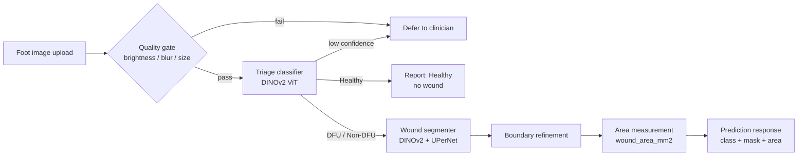
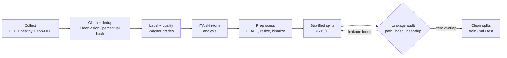
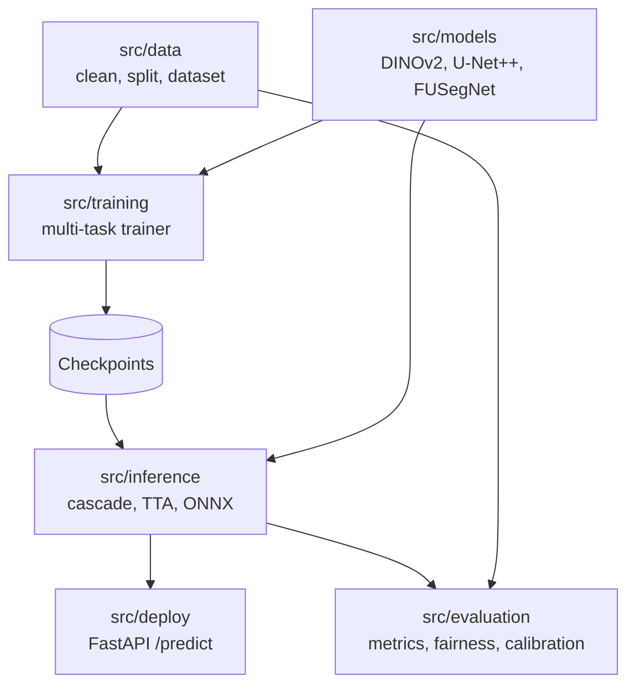

# DiaFoot.AI — Complete Project Report

**Package:** `diafootai` v2.0.0 · Python 3.12–3.13 · PyTorch 2.10
**License:** MIT · **Status:** Beta (research code, not a cleared medical device)
**Report date:** 2026-07-17

> **Data-provenance and honesty note (read first).** Every performance number in this
> report comes from the machine-readable evaluation artifacts in `results/*.json` and
> `data/metadata/*.json`, computed on **leakage-audited clean splits**. These numbers
> supersede the headline in `CHANGELOG.md` (v2.0.0, Dice 85.89%), which is a DFU-only,
> single-skin-tone subgroup figure produced **before** the data-leakage fix. Where an
> analysis was run on a different split or an earlier checkpoint, that provenance is
> stated inline. Nothing here is rounded up for effect.

---

## 1. Executive summary

DiaFoot.AI classifies a foot photograph as `Healthy`, `Non-DFU`, or `DFU`, segments the
wound when one is present, and measures wound area in mm². It is a **cascaded multi-task**
pipeline built to be honest about its limits.

Headline results (leakage-audited test set, n = 1,161):

| Capability | Metric | Value |
|---|---|---|
| Triage classification | Accuracy | **98.4%** |
| Triage classification | DFU sensitivity | **96.6%** |
| Triage classification | Macro AUROC | **0.999** |
| Wound segmentation (DFU wounds) | Dice | **0.891** |
| Wound segmentation (5-fold CV) | Dice | **0.853 ± 0.009** |
| Boundary quality (DFU) | HD95 | **11.3 px** |
| Calibration | ECE (after temp. scaling) | **0.007** |
| Deployment | ONNX speedup | **4.5×** |

Two caveats define the project's integrity: (1) on the **full mixed** test set the
segmentation *mean* Dice falls to 0.65–0.72 because empty-mask images punish any false
positive (median stays 0.93); (2) the triage **classifier does not generalize** to unseen
image sources (external accuracy 21%, DFU sensitivity 0%). Both are documented in full below.

---

## 2. Problem and clinical motivation

Diabetic foot ulcers are a leading cause of lower-limb amputation. Automated triage plus wound
measurement can support earlier intervention. DiaFoot.AI **v1** segmented every image as if it
contained an ulcer — it had no concept of "not a wound", so it hallucinated ulcers on healthy
skin. **v2** puts a classifier in front so the system can abstain on healthy skin, and adds a
defer-to-clinician gate so low-confidence or low-quality inputs go to a human instead of
producing an unreliable answer.

### Pipeline overview



---

## 3. Dataset

### 3.1 Composition (verified image/mask counts)

| Category | Images | Masks | Paired | Mask type |
|---|---|---|---|---|
| DFU (incl. AZH) | 2,119 | 2,119 | 2,119 | Wound boundary |
| Healthy feet | 3,300 | 3,300 | 3,300 | Empty (all-zero) |
| Non-DFU conditions | 2,686 | 2,686 | 2,686 | Non-DFU wound boundary |
| **Total** | **8,105** | **8,105** | **8,105** | — |

All images are 512×512 after preprocessing (0 orphans, 0 non-512 in sample). The AZH wound-care
dataset (1,109 images) is integrated into the DFU category. Sources span FUSeg, AZH, Kaggle, and
Mendeley (healthy/non-DFU).

### 3.2 Skin-tone distribution (ITA — Individual Typology Angle)

Computed for fairness auditing. Higher ITA = lighter skin.

| Dataset | Analyzed | Mean ITA | Dominant categories |
|---|---|---|---|
| DFU (FUSeg subset) | 810 | −50.55 | Dark 633, Brown 72, Very Light 56 |
| Healthy | 3,300 | 62.00 | Very Light 2,472, Brown 220, Dark 180 |
| Non-DFU | 2,686 | −7.02 | Dark 931, Brown 685, Tan 401 |

The DFU images skew toward darker skin tones; healthy images skew light. This imbalance is why
fairness is audited on the DFU-only slice (Section 5.6).

### 3.3 Splits and leakage audit

Final splits are **70/15/15, doubly stratified** by ITA skin tone and class:

| Split | Count | Classes |
|---|---|---|
| Train | 5,782 | Healthy + Non-DFU + DFU |
| Val | 1,162 | — |
| Test | 1,161 | Healthy 495 · Non-DFU 403 · DFU 263 |

**Leakage fix (the integrity story).** A perceptual-hash audit of the pre-fix splits found large
numbers of near-duplicate image pairs straddling train and test — a model tested partly on images
it effectively trained on reports inflated scores. The splits were rebuilt from scratch and
re-audited.

| Overlap axis | Before (baseline) | After (clean recheck) |
|---|---|---|
| Path overlap (train×test) | 0 | 0 |
| Canonical-ID overlap (train×test) | 0 | 0 |
| Content-hash overlap (train×test) | 0 | 0 |
| **Near-duplicate pairs (train×test)** | **96,829** | **0** |
| Near-duplicate pairs (train×val) | 13,557 | 0 |
| Near-duplicate pairs (val×test) | 2,375 | 0 |
| `has_any_leakage` | **True** | **False** |

All results in Sections 4–5 are on the clean (`has_any_leakage: False`) splits.

### 3.4 Data pipeline



---

## 4. Method and architecture

Two model families are implemented. The **deployed** path is DINOv2-based; U-Net++ / FUSegNet /
nnU-Net exist for research and ablation.



| Stage | Deployed model | Research alternatives |
|---|---|---|
| Triage classifier | DINOv2 ViT + 3-class head (LoRA rank 8, α 16) | EfficientNet-V2-M |
| Wound segmenter | DINOv2 + UPerNet decoder | U-Net++ (EfficientNet-B4, scSE), FUSegNet (EfficientNet-B7, P-scSE), nnU-Net v2 |
| Post-processing | Morphological + connected-component boundary refinement | — |

### Training configuration (actual values)

| Setting | Value |
|---|---|
| Seed | 42 |
| Image size | 512×512 (deploy: 518×518 for DINOv2) |
| Batch size | 16 (baseline) / 24 (multi-task) |
| Optimizer | AdamW, lr 1e-4, weight decay 1e-2 |
| Scheduler | Cosine annealing, 10-epoch linear warmup |
| Precision | BFloat16 mixed (H200) |
| Segmentation loss | DiceCE / Dice-boundary compound |
| Classification loss | Focal |
| Staging loss | Label-smoothing CE (0.1) |
| EMA decay | 0.999 |
| Early stopping | patience 15 |
| Multi-task weights | classification 1.0 · segmentation 2.0 · staging 1.0 (GradNorm dynamic) |
| Curriculum | classifier warmup 10 ep · seg unfreeze ep 10 · staging unfreeze ep 20 |

---

## 5. Results (actual values)

### 5.1 Triage classification — test set (n = 1,161)

| Metric | Value |
|---|---|
| Accuracy | 0.9836 |
| Macro F1 | 0.9812 |
| Weighted F1 | 0.9836 |
| Macro precision | 0.9820 |
| Macro recall | 0.9805 |
| Macro AUROC | 0.9991 |
| DFU sensitivity (recall) | 0.9658 |
| Healthy specificity | 0.9955 |

Per class:

| Class | Precision | Recall | F1 | AUROC | Support |
|---|---|---|---|---|---|
| Healthy | 0.9940 | 0.9980 | 0.9960 | 1.0000 | 495 |
| Non-DFU | 0.9752 | 0.9777 | 0.9765 | 0.9984 | 403 |
| DFU | 0.9769 | 0.9658 | 0.9713 | 0.9989 | 263 |

**Calibration and abstention:**

| Metric | Value |
|---|---|
| ECE before temperature scaling | 0.0394 |
| ECE after (T = 0.4) | 0.0075 |
| Brier before → after | 0.0344 → 0.0258 |
| Defer threshold | 0.95 |
| Coverage at threshold | 0.9345 (defer rate 0.0655) |
| Kept / deferred cases | 1,085 / 76 |
| **Accuracy on kept cases** | **0.9972** |

The defer gate trades 6.5% coverage for 99.7% accuracy on the cases it keeps.

### 5.2 Wound segmentation — test set

| Slice | Dice | IoU | HD95 (px) | NSD@2mm | NSD@5mm |
|---|---|---|---|---|---|
| **DFU wounds only** (n = 263) | 0.891 | 0.829 | 11.3 | 0.888 | 0.972 |
| **Full mixed set** (n = 1,161), mean | 0.718 | 0.673 | 66.1 | 0.643 | 0.713 |
| **Full mixed set**, median | 0.929 | 0.868 | 5.0 | 0.887 | 1.000 |
| **5-fold CV** (DFU) | 0.853 ± 0.009 | 0.785 ± 0.010 | — | — | — |

**Why mean ≪ median on the mixed set:** healthy and non-DFU images have empty ground-truth masks;
Dice on an empty mask is 0 if the model predicts even one false-positive pixel. A handful of such
near-zero scores collapse the mean while the median (dominated by real wounds) stays high. Judge
wound-outlining quality from the DFU-only mean (0.891) and the median (0.929).

### 5.3 Training-data composition study (5 compositions × 3 architectures × 5-fold CV)

A controlled study fixes the architecture and varies only the training-set *composition*, evaluated on
a single fixed, leakage-controlled test set every fold (5-fold CV; DFU-Dice over ~318 DFU test images).
The ranking is **identical across all three architectures**: **DFU+Healthy > DFU-only > All >
DFU+Non-DFU > Random-mixed** — *composition beats size*. The size-matched Random-mixed control (same
image budget as DFU-only) is worst, and adding non-DFU wounds inflates false positives on healthy skin.

| Architecture | Composition | Train imgs | DFU Dice (mean ± std) | DFU IoU | FP-on-empty |
|---|---|---|---|---|---|
| U-Net++ | DFU + Healthy | 3,645 | **0.879 ± 0.003** | **0.809** | 0.009 |
| U-Net++ | DFU-only | 1,427 | 0.872 ± 0.004 | 0.799 | 0.083 |
| U-Net++ | All | 5,497 | 0.846 ± 0.010 | 0.770 | 0.015 |
| U-Net++ | DFU + Non-DFU | 3,279 | 0.834 ± 0.011 | 0.754 | 0.221 |
| U-Net++ | Random-mixed | 1,427 | 0.795 ± 0.013 | 0.704 | 0.016 |
| SegFormer-B0 | DFU + Healthy | 3,645 | **0.856 ± 0.002** | **0.778** | 0.008 |
| SegFormer-B0 | DFU-only | 1,427 | 0.844 ± 0.004 | 0.763 | 0.089 |
| SegFormer-B0 | All | 5,497 | 0.799 ± 0.003 | 0.706 | 0.010 |
| SegFormer-B0 | DFU + Non-DFU | 3,279 | 0.791 ± 0.007 | 0.696 | 0.448 |
| SegFormer-B0 | Random-mixed | 1,427 | 0.717 ± 0.022 | 0.611 | 0.022 |
| DINOv2 + dec. | DFU + Healthy | 3,645 | **0.843 ± 0.004** | **0.759** | 0.009 |
| DINOv2 + dec. | DFU-only | 1,427 | 0.835 ± 0.004 | 0.750 | 0.025 |
| DINOv2 + dec. | All | 5,497 | 0.809 ± 0.005 | 0.717 | 0.010 |
| DINOv2 + dec. | DFU + Non-DFU | 3,279 | 0.792 ± 0.010 | 0.697 | 0.058 |
| DINOv2 + dec. | Random-mixed | 1,427 | 0.752 ± 0.019 | 0.645 | 0.019 |

This is the subject of a manuscript in preparation (SPIE Medical Imaging). Full per-cell metrics
(bootstrap CIs, HD95, NSD, paired-vs-DFU-only deltas, provenance hashes) are in `results/composition/`
and `results/composition_comparison.{json,md}`. Note this study uses a composition-specific split
regime (pool of 6,890 + a fixed test set), separate from the deployed cascade's splits in §5.1–5.2, so
the two sets of numbers are not directly comparable.

### 5.4 Clinical wound-area agreement (n = 3, indicative only)

| Metric | Value |
|---|---|
| MAE | 7.23 mm² |
| RMSE | 9.86 mm² |
| MAPE | 3.28% |
| Bias | +5.70 mm² |
| Pearson r | 0.9997 |

The near-perfect correlation is on **only 3** manually measured wounds — treat as indicative, not
validated.

### 5.5 Test-time augmentation (200-image subset)

| Config | Dice | IoU | HD95 |
|---|---|---|---|
| Base | 0.574 | 0.523 | 87.5 |
| TTA (16 augmentations) | 0.613 | 0.563 | 84.9 |

TTA adds +3.9% Dice. The absolute values are low because this subset is mixed (empty-mask images
included).

### 5.6 Fairness (ITA skin tone)

| Slice | Group | n | Dice | Gap | Bias concern |
|---|---|---|---|---|---|
| DFU-only | Brown | 285 | 0.859 | **0.00** | No |
| All images | Brown | 915 | 0.582 | 0.114 | Flagged |
| All images | Tan | 1 | 0.468 | — | — |

**Honest reading:** the DFU-only fairness gap is 0.00. The all-images "gap" of 0.114 is the
difference between the Brown group (n = 915) and the Tan group (**n = 1**) — it is driven by a
single image and is not statistically meaningful. The test set is effectively one ITA group
(`brown`/`unknown`), so a robust cross-tone fairness claim cannot be made from this split; broader
skin-tone evaluation is future work.

### 5.7 External validation (unseen datasets)

| Task | Internal | External | Absolute drop |
|---|---|---|---|
| Classification accuracy | 1.000 | **0.210** | −0.790 |
| Classification macro-F1 | 1.000 | 0.333 | −0.667 |
| **DFU sensitivity** | 1.000 | **0.000** | −1.000 |
| Healthy specificity | 1.000 | 0.989 | −0.011 |
| Segmentation Dice (DFU) | 0.891 | **0.893** | +0.002 (no drop) |
| Segmentation HD95 (DFU) | 11.3 | 9.5 | improves |

**The single most important limitation:** the **segmenter transfers** to new wound datasets
(external DFU Dice 0.893, n = 552, essentially no drop), but the **triage classifier collapses**
on out-of-distribution sources — external accuracy 21%, DFU sensitivity 0%, external per-class F1
Healthy 0.965 / Non-DFU 0.035 / DFU 0.000. Do not deploy the classifier on a new image source
without re-validating on that source. (The internal accuracy shown here is from the external-
validation run's own checkpoint; the calibrated production classifier scores 0.984 internally,
Section 5.1.)

### 5.8 Segmentation failure atlas (DFU test subset, n = 319)

| Category | Count |
|---|---|
| Acceptable | 302 |
| Boundary error | 7 |
| False positive on empty GT | 8 |
| Poor overlap | 2 |

95% of DFU test segmentations are acceptable; the dominant failure mode is false positives on
empty ground truth (8) — consistent with the mixed-set mean-vs-median gap in Section 5.2. (Run on
an earlier DFU-only test split of 319 images.)

### 5.9 Deployment performance (ONNX parity)

| Metric | Value |
|---|---|
| Samples | 128 |
| Mask agreement (ONNX vs PyTorch) | 99.99% (min 99.996%) |
| Mean absolute output diff | 0.0012 |
| PyTorch latency | 1,055.8 ms |
| ONNX latency | 235.0 ms |
| **Speedup** | **4.5×** |

### 5.10 Shortcut-reliance audit (supplementary, provenance caveat)

Run on an **earlier classifier checkpoint** (`best_epoch004_1.0000.pt`, 100% baseline accuracy)
over 319 images, so read the *relative* robustness, not the absolute accuracy:

| Perturbation | Accuracy drop | Prediction consistency |
|---|---|---|
| Border noise | 3.4% | 96.6% |
| Center-only (background removed) | 0.0% | 100% |
| Blur background | 0.3% | 99.7% |

The near-zero drop when the background is removed or blurred suggests the classifier keys on the
foot/wound region rather than background shortcuts. Because the checkpoint predates the leakage-
clean classifier, treat this as a directional signal only.

---

## 6. Deployment

`uvicorn src.deploy.app:app --host 0.0.0.0 --port 8000` exposes:

| Method | Path | Description |
|---|---|---|
| GET | `/health` | Liveness + whether the model is loaded |
| GET | `/model/info` | Model metadata, thresholds, limits |
| POST | `/predict` | Upload image → classification, wound stats, area, defer flags |

`/predict` enforces upload guards (content type, max size), an image-quality gate
(brightness/blur/size → `defer_to_clinician`), and a configurable rate limit. The response carries
`classification`, `classification_confidence`, `classification_probs`, `defer_to_clinician`,
`defer_reason`, `quality_flags`, `has_wound`, `wound_area_mm2`, `wound_coverage_pct`, and
`inference_time_ms`. Deploy via uvicorn, Docker Compose (`docker/`), or the exported ONNX model.

---

## 7. Limitations

1. **Not a medical device.** No regulatory clearance; not for diagnosis or treatment.
2. **Triage classifier does not generalize across image sources** (external accuracy ~21%, DFU
   sensitivity 0%). Re-validate before any new-source use.
3. **Segmentation mean vs median gap:** aggregate mean Dice on mixed data is depressed by
   empty-mask false positives; judge wound performance from DFU-only / median numbers.
4. **Fairness is under-powered by the test split:** the mixed-set gap (0.114) is driven by a
   single `tan` image; DFU-only gap is 0.00. Broad skin-tone fairness is unproven.
5. **Small clinical-agreement sample** (area agreement n = 3).
6. **Some components are implemented but untrained** (MedSAM2 LoRA, nnU-Net v2).
7. **Mixed provenance in supplementary analyses** (shortcut audit / failure atlas use an earlier
   split or checkpoint), flagged inline.

---

## 8. Reproducibility

| Item | Value |
|---|---|
| Seed | 42 |
| PyTorch | 2.10.0 |
| NumPy / SciPy / scikit-learn | 1.26.4 / 1.15.1 / 1.6.1 |
| OpenCV | 4.11.0 |
| Repro bundle generated | 2026-03-11 |

Reproduce the honest re-run end to end:

```bash
python scripts/run_data_pipeline.py        # clean → ITA → splits
python scripts/run_leakage_audit.py        # verify has_any_leakage == false
python scripts/train.py --config configs/training/dinov2_baseline.yaml
python scripts/evaluate.py --task classify --checkpoint <ckpt>
python scripts/evaluate.py --task segment  --checkpoint <ckpt>
```

See `docs/HPC_HONEST_RERUN_RUNBOOK.md` for the HPC procedure.

---

## 9. Repository and documentation index

```
DiaFoot.AI/
├── src/{data,models,training,evaluation,inference,deploy}/
├── scripts/        34 CLI entry points
├── configs/        data / model / training / ablation / deploy YAML
├── slurm/          HPC batch jobs
├── tests/          pytest suite (244 passing, -m "not gpu")
├── results/        verified evaluation JSON (source of every number here)
└── docs/           Diataxis documentation
```

| Document | Purpose |
|---|---|
| `README.md` | Overview + honest results |
| `docs/tutorial-getting-started.md` | Install → first prediction |
| `docs/howto-run-data-pipeline.md` | Build leak-free splits |
| `docs/howto-train.md` | Train and evaluate |
| `docs/howto-serve-api.md` | Serve / deploy the API |
| `docs/reference-cli.md` | Every CLI script + flags |
| `docs/reference-api.md` | REST endpoints and schemas |
| `docs/reference-architecture.md` | `src/` module map |
| `docs/explanation-pipeline-design.md` | Why cascaded multi-task; the leakage story |
| `docs/HPC_HONEST_RERUN_RUNBOOK.md` | Reproduce the honest re-run |

---

## 10. Version history (v1 → v2)

| Metric | v1 | v2 (honest, clean splits) |
|---|---|---|
| Clinical specificity | 0% (segmented every image) | classifier abstains on healthy skin |
| Data categories | 1 (DFU only) | 3 (DFU + healthy + non-DFU) |
| Data cleaning / leakage audit | none | full pipeline, `has_any_leakage: False` |
| Segmentation Dice | 91.7% (inflated, DFU-only, uncleaned) | 0.891 DFU-only / 0.853 CV / 0.929 median mixed |
| Classification accuracy | n/a | 0.984 |
| Boundary metrics (HD95, NSD) | not measured | 11.3 px / 0.972 (DFU) |
| Skin-tone fairness | not measured | 0.00 gap (DFU-only) |
| Calibration | not measured | ECE 0.0075 (post temp. scaling) |

v1's 91.7% Dice was measured on uncleaned, ulcer-only data with no negative examples. v2's lower
numbers are the honest cost of measuring the right thing.
